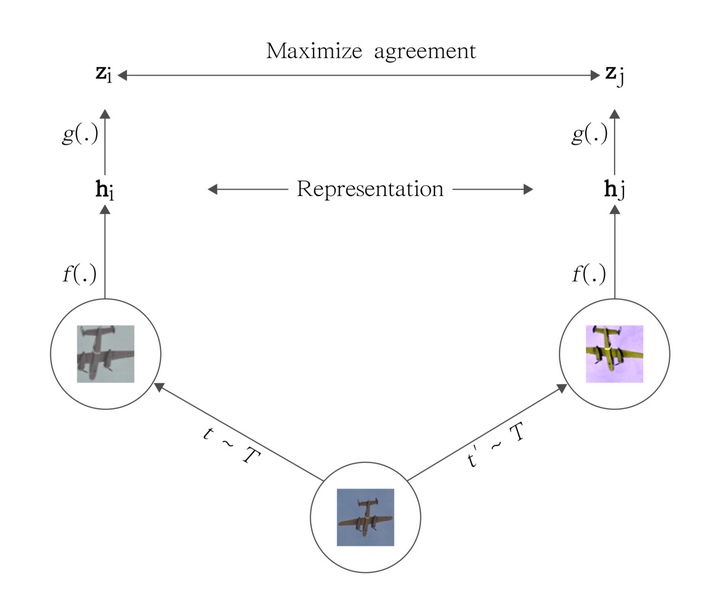

# SimCLR
This is an implementaton of SimCLR from the paper:
https://arxiv.org/pdf/2002.05709.pdf

## Overview

SimCLR presents a method for unsupervised pretraining of a backbone model, designed 
to extract features that can that can be detected across image warping.

To do this two augmentations of the same image are generated and passed into a backbone
network, and then a projection head. Each head of the projection is compared, with the goal 
of matching like-pairs and separating negative pairs. This is called Contrastive Loss.

The augmentations used mainly in this paper consist of:

 - Random Crop (0.08, 1.0) size and (3/4, 4/3) ratio
 - Random Horizontal Flip (50%)
 - Random Color Distortion - Grayscale (20%), Jitter
 - Random Gaussian Blur (Kernel - 10% of image size, sigma - [0.01, 2])
 
 Following this the projection head is removed and a final layer can be tuned for class
 outputs.
 
 
 
 ## Code Components
 
    1. Model
        a. Encoder (uses resnet18 or 50)
        b. Projection Head (between 512-2048 units, hidden layer + output layer)
        c. Output Head (single layer with num_classes as output)
    2. Dataset
        a. CIFAR10 is default (can be modified to n-classes)
        b. TinyImageNet also added (download externally)
    3. Augmentation module
    4. Loss
        a. Contrastive Loss (NT-XENT)
        b. CrossEntropy (for final layer tuning)
    5. Optimziers
        a. Adam/SGD
        b. LARS (layer-wise tuned for high batch sizes)
        
 ## Setup
 
 To get the required setups run
 
 > pip3 install -r requirements.txt

## Running Code
The code arguments are setup with defaults in main.py. The main changes would 
be to the --base_model (resnet to be used), --lr, and --contrastive (to compare 
between original and contrastive network)

To test original resnet accuracy
 > python3 main.py --contrastive False --epoch 50

And compare to contrastive model
 > python3 main.py

Changing --base_model 50 would provide better results